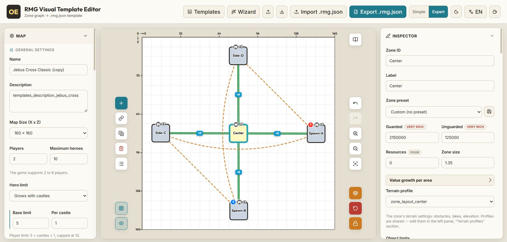

# Olden Era RMG Visual Template Editor

A visual editor for random-map (RMG) templates of **Heroes of Might and Magic: Olden Era**. Build and tweak `.rmg.json` templates on a drag-and-drop zone graph instead of hand-editing JSON.

> _This project was developed with the help of AI assistants (Claude, Codex, Antigravity)._

**[English](#english)** · **[Русский](#русский)**



---

## English

A convenient visual editor for Olden Era map templates. You lay zones out on a canvas, connect them, and the app turns the graph into a valid `.rmg.json` template the game can read — no JSON by hand.

### Two modes

- **Simple** — only the essential settings, so a newcomer can put a playable map together without drowning in options.
- **Expert** — exposes almost everything the template format supports: per-zone treasure values and guards, terrain profiles, content pools and count limits, placement rules, main objects, generation variants, and more.

You switch between them with one toggle; the simple view just hides the advanced blocks.

### What you can do

- **Import any game template.** Load a stock `.rmg.json` from the game and edit it however you like — the import is round-trip verified against every official template, so nothing is silently lost.
- **Start from a recipe.** One click applies a whole ready-made template (a 1v1 ladder from tiny to huge maps, multiplayer rings/stars, special victory modes), then refine it by hand.
- **Or start from absolute zero.** An empty canvas, add zones and connections yourself, set everything manually.

### Key features

- Drag-and-drop **zone graph** with connections, springs and live geometry.
- **Topology wizard** — generate a map skeleton (ring / chain / star / random) with a chosen number of players, neutral zones and neutral cities.
- **Reusable presets** for zones, terrain profiles, content pools and count limits, with built-in factory sets and one-click reset.
- **Main objects** — starting castles, neutral cities (player-faction or random), abandoned outposts, the gladiator arena, owners and building sets.
- **Starting bonuses** and **global bans**, including a one-click standard ban set.
- **Human-readable value badges** instead of bare numbers (so "200k" reads as a quality tier).
- **Live validation** and a **JSON preview** that always shows the exact template that will be written.
- **Balance analysis** — a 0–100 score plus a summary of what's inside the map.
- **Save straight into the game's** `map_templates` folder, or download the file.
- **RU / EN** interface, **dark / light** themes, and autosave of your work.

---

## Русский

Удобный визуальный редактор шаблонов карт для Olden Era. Зоны раскладываются на холсте и соединяются связями, а приложение само превращает граф в готовый шаблон `.rmg.json`, который читает игра — никакого JSON руками.

### Два режима

- **Простой** — только основные настройки, чтобы новичок собрал играбельную карту, не утонув в опциях.
- **Эксперт** — открывает почти всё, что поддерживает формат шаблонов: ценности и охрану сокровищ по зонам, профили рельефа, пулы и лимиты контента, правила размещения, главные объекты, варианты генерации и многое другое.

Переключение — одной кнопкой; простой режим просто прячет продвинутые блоки.

### Что можно делать

- **Импортировать любой шаблон из игры.** Загрузи стоковый `.rmg.json` и правь как угодно — импорт выверен по всем официальным шаблонам, так что ничего не теряется по-тихому.
- **Начать с рецепта.** Один клик применяет целый готовый шаблон (лесенка дуэлей 1×1 от мелких до огромных карт, мультиплеерные кольца/звёзды, спецрежимы победы), а дальше доводишь руками.
- **Или с абсолютного нуля.** Пустой холст, сам добавляешь зоны и связи, всё настраиваешь вручную.

### Ключевые возможности

- **Граф зон** с drag-and-drop, связями, пружинами и живой геометрией.
- **Мастер топологий** — генерация скелета карты (кольцо / цепь / звезда / случайно) с нужным числом игроков, нейтральных зон и нейтральных городов.
- **Переиспользуемые пресеты** зон, профилей рельефа, пулов и лимитов контента, со встроенными заводскими наборами и сбросом в один клик.
- **Главные объекты** — стартовые замки, нейтральные города (фракции игрока или случайные), заброшенные форпосты, гладиаторская арена, владельцы и наборы построек.
- **Стартовые бонусы** и **глобальные баны**, включая стандартный набор банов одной кнопкой.
- **Понятные бейджи ценности** вместо голых чисел (чтобы «200k» читалось как качественный уровень).
- **Живая валидация** и **превью JSON**, всегда показывающее точный шаблон, который будет записан.
- **Анализ баланса** — балл 0–100 и сводка «что внутри» карты.
- **Сохранение прямо в папку** `map_templates` игры или скачивание файла.
- Интерфейс **RU / EN**, **тёмная / светлая** темы и автосохранение.

---

## Development

```powershell
npm install
npm run dev
```

Production build:

```powershell
npm run build
```

## Tests

Run the complete test suite:

```powershell
npm test
```

The official-template suite uses the stock game templates from:

```text
D:\SteamLibrary\steamapps\common\Heroes of Might and Magic Olden Era\HeroesOldenEra_Data\StreamingAssets\map_templates
```

When that directory is unavailable, `npm test` skips the game-dependent suite.
Use the strict command when the game installation is required:

```powershell
npm run test:game
```

For another installation location, set `OLDEN_ERA_TEMPLATES_DIR`:

```powershell
$env:OLDEN_ERA_TEMPLATES_DIR = "E:\Games\Olden Era\HeroesOldenEra_Data\StreamingAssets\map_templates"
npm run test:game
```

The round-trip suite checks all templates in the official manifest for:

- successful import and export;
- preservation of the editor-visible model after `import -> export -> import`;
- stable canonical JSON after a second round trip;
- changes to the known unsupported-feature baseline.

The editor models multiple generation variants per template: importing a
multi-variant template keeps every variant, you can switch/add/duplicate/delete
them from the Variants section of the left panel, and exporting writes them all
back. The compatibility baseline now records only the special connection types
that are not modeled yet (`Default`, `Portal`, and `GladiatorArena`). Adding
support for those requires updating the implementation and the baseline
together.

## Architecture

For the module layout of the store and UI panels see [ARCHITECTURE.md](ARCHITECTURE.md).

## Contributing

Issues and pull requests are welcome.
